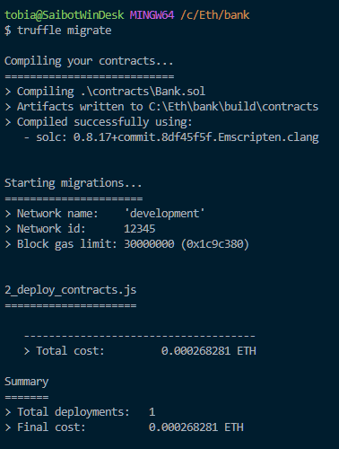
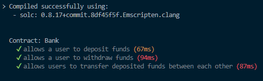

# Blockchain Assignment 2 | Ethereum and Smart Contracts

The implementation of the Smart Contract and tests are based on [this video](https://www.youtube.com/watch?v=DKFVnGcMTD0&). To add my own contribution, I have added a function that allows users to transfer deposited funds between each other. A test has also been added for this function.

---
## Deployment
The contract has been deployed with the configuration specified in truffle-config.js. It is assumed that the account with the "coinbase" account id is unlocked.

To run geth in a configuration compatible with truffe-config.js the following command is used:
```
geth --networkid 12345 --nodiscover --datadir node --maxpeers=0 --allow-insecure-unlock --http --http.corsdomain "*" --http.api "eth,net,web3,personal,miner" --http.port 30303
```

The commands `truffle compile` and `truffle migrate --network production` are used to start the deployment. In order to finalize the deployment, the miner is started in the geth JS console. 

**Screenshots of deployment:**



---
## Tests
To run the tests, use the command: `truffle test`

**Screenshots of passing tests:**


